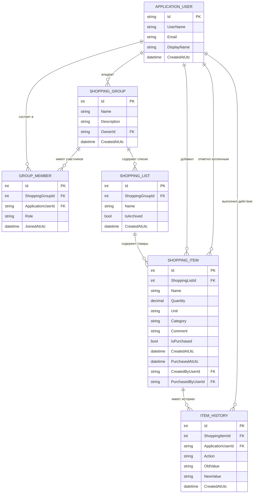

# ER-диаграмма базы данных

## Описание

ER-диаграмма отражает структуру базы данных приложения **«Совместный список покупок»**. В центре модели находится пользователь Identity (`APPLICATION_USER`), который может состоять в нескольких группах через таблицу `GROUP_MEMBER`. Внутри групп создаются списки покупок, внутри списков — товары. Для товаров хранится история действий.

## Ключевые ограничения

- Пользователь может быть участником одной группы только один раз.
- Список покупок всегда принадлежит одной группе.
- Товар всегда принадлежит одному списку покупок.
- Категория и комментарий товара хранятся в `SHOPPING_ITEM`.
- Автор добавления товара и пользователь, отметивший товар купленным, хранятся ссылками на `APPLICATION_USER`.
- История действий связана с товаром и пользователем, выполнившим действие.
