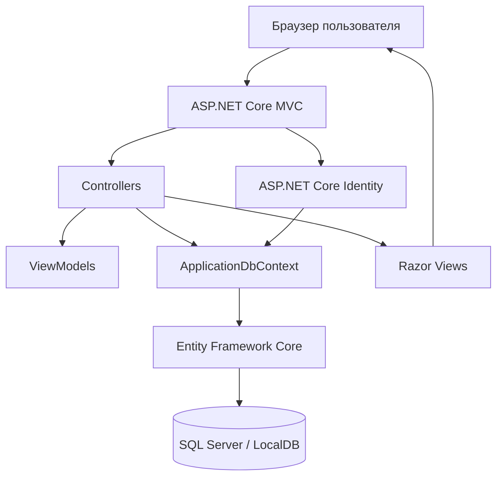

# Технические требования

## 1. Цель проекта

Цель дипломной работы — разработать информационную систему **«Совместный список покупок»**, которая позволяет нескольким пользователям совместно вести группы покупок, создавать списки, добавлять товары, отмечать товары как купленные и отслеживать участников, выполнивших действия.

## 2. Задачи проекта

- Проанализировать предметную область совместного планирования покупок.
- Спроектировать структуру базы данных для пользователей, групп, списков, товаров и истории действий.
- Реализовать регистрацию, вход и выход пользователей с помощью ASP.NET Core Identity.
- Ограничить доступ к группам и спискам только для участников соответствующей группы.
- Реализовать создание групп покупок и добавление участников по email.
- Реализовать создание списков покупок внутри группы.
- Реализовать добавление, редактирование, удаление и отметку товаров как купленных с категориями, комментариями и историей изменений.
- Реализовать фильтрацию товаров по статусу покупки.
- Подготовить документацию, диаграммы и тестовые сценарии для дипломной работы.

## 3. Пользователи системы

| Пользователь | Описание |
| --- | --- |
| Гость | Неавторизованный посетитель. Может открыть главную страницу, зарегистрироваться или войти в систему. |
| Авторизованный пользователь | Зарегистрированный пользователь. Может создавать группы, списки и товары, а также участвовать в группах, куда его добавили. |
| Владелец группы | Пользователь, создавший группу. На текущем этапе владелец является участником группы и может добавлять других зарегистрированных пользователей. |

## 4. Функциональные требования

### 4.1. Авторизация и учётные записи

- Система должна предоставлять регистрацию пользователя по email, имени и паролю.
- Система должна предоставлять вход пользователя по email и паролю.
- Система должна предоставлять выход пользователя из аккаунта.
- Система должна валидировать формы регистрации и входа.
- Система должна защищать страницы групп и списков от неавторизованных пользователей.

### 4.2. Группы покупок

- Авторизованный пользователь должен иметь возможность создать группу покупок.
- Создатель группы должен автоматически добавляться в группу как участник с ролью `Владелец`.
- Пользователь должен видеть только те группы, где он является участником.
- Владелец группы должен иметь возможность добавить другого зарегистрированного пользователя в группу по email.
- Система не должна добавлять одного и того же пользователя в одну группу повторно.

### 4.3. Списки покупок

- Участник группы должен иметь возможность создать список покупок внутри этой группы.
- Пользователь должен видеть только списки из групп, где он является участником.
- Пользователь должен иметь возможность открыть список покупок и просмотреть товары.

### 4.4. Товары

- Участник группы должен иметь возможность добавить товар в список.
- Участник группы должен иметь возможность редактировать название, количество и единицу измерения товара.
- Участник группы должен иметь возможность удалить товар из активного списка.
- Участник группы должен иметь возможность отметить товар как купленный или отменить отметку.
- Система должна отображать пользователя, который добавил товар.
- Система должна отображать пользователя, который отметил товар как купленный.
- Система должна предоставлять фильтры: все товары, купленные товары, некупленные товары.
- Система должна хранить категорию и необязательный комментарий товара.
- Система должна показывать историю действий с товарами.
- Владелец группы должен управлять названием, описанием и участниками группы.
- Список покупок можно переименовать, удалить или архивировать.

## 5. Нефункциональные требования

| Категория | Требование |
| --- | --- |
| Безопасность | Доступ к группам, спискам и товарам должен проверяться по членству пользователя в группе. |
| Надёжность | Изменения данных должны сохраняться в SQL Server через Entity Framework Core. |
| Удобство использования | Интерфейс должен быть построен на Bootstrap и поддерживать базовую адаптивность. |
| Поддерживаемость | Код должен быть разделён на модели, контроллеры, представления, контекст данных и view model. |
| Расширяемость | Структура должна позволять добавить роли, приглашения, историю изменений и уведомления на следующих этапах. |
| Совместимость | Проект должен открываться и запускаться в Visual Studio 2022 с установленным .NET 8 SDK. |

## 6. Архитектура приложения

Приложение построено по шаблону **ASP.NET Core MVC**.

### Основные слои

- **Models** — доменные сущности приложения и пользователь Identity.
- **ViewModels** — модели данных для форм и страниц.
- **Controllers** — обработка HTTP-запросов, проверка прав доступа и вызов EF Core.
- **Views** — Razor-страницы пользовательского интерфейса.
- **Data** — `ApplicationDbContext` и настройка связей базы данных.
- **Migrations** — миграции Entity Framework Core для создания схемы SQL Server.

## 7. Технологический стек

- C#
- ASP.NET Core MVC
- ASP.NET Core Identity
- Entity Framework Core
- SQL Server / LocalDB
- Razor Views
- Bootstrap
- Visual Studio 2022
- .NET 8 SDK
