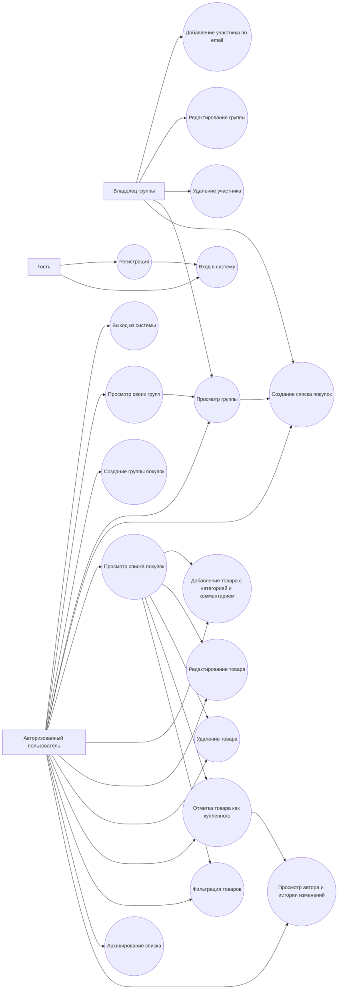

# Диаграмма вариантов использования

## Описание

Диаграмма показывает основные действия пользователей информационной системы **«Совместный список покупок»**.

## Участники

- **Гость** — пользователь без входа в систему.
- **Авторизованный пользователь** — зарегистрированный пользователь, который может работать с доступными ему группами, списками и товарами.
- **Владелец группы** — пользователь, создавший группу. На текущем этапе он может добавлять участников в группу.
